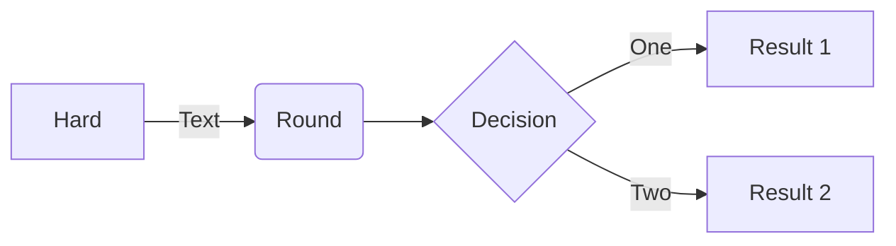

# My Project

My Decription

# To run the main program, first start the virtual environment, then execute the app module
## Create and install dependencies, if necessary
```sh
pyenv activate agenticrag-env
```
```sh
python project/app.py
```
## Run in debug mode
```sh
python project/app.py -d
```
## To get help
```sh
python project/app.py -h
```

## Reference
https://docs.python-guide.org/writing/structure/

## ToDo
* A thing

### _sample mermaid chart_


## Sample queries
what are the top skills I should be working on to become a better product manager
